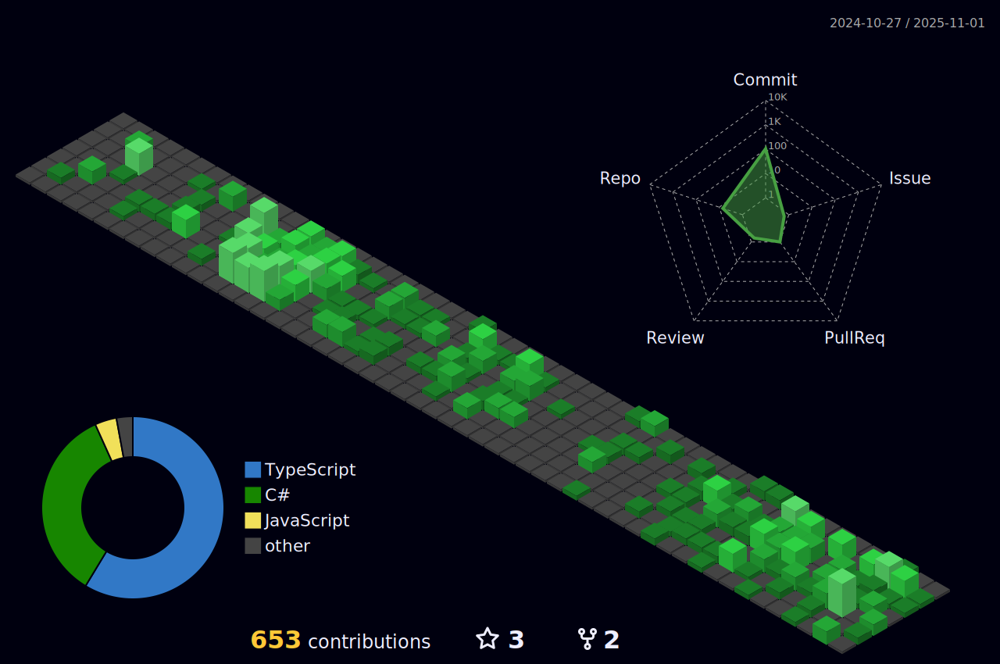

<h2 align="center">Hi there 👋, My name is Andrey Araújo</h2>

  
  
  
  
  
  

 

:computer: Fullstack Developer  
:house: Brazilian, Based in Itapipoca, CE  
🎓 Graduated in Systems Analysis and Development  
🤖 All of my projects are available at <a href="www.andreyaraujo.dev">andreyaraujo.dev</a> 
📝 I regularly write articles on <a href="www.andreyaraujo.dev">andreyaraujo.dev</a>, <a href="https://dev.to/andreyaraujo">Dev.to</a>

## 💻 Tech Stack

